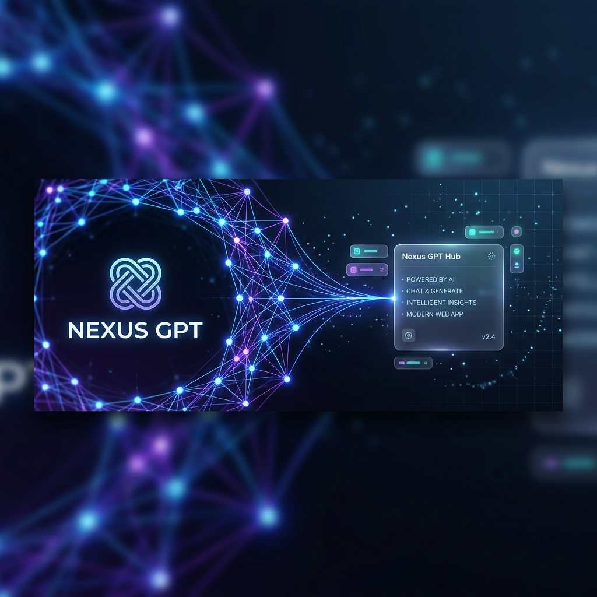
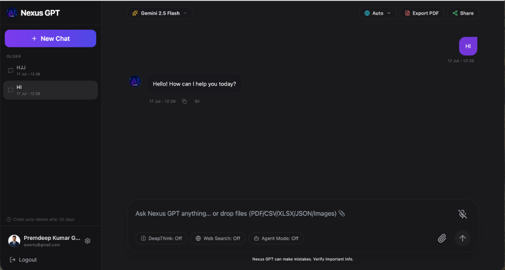
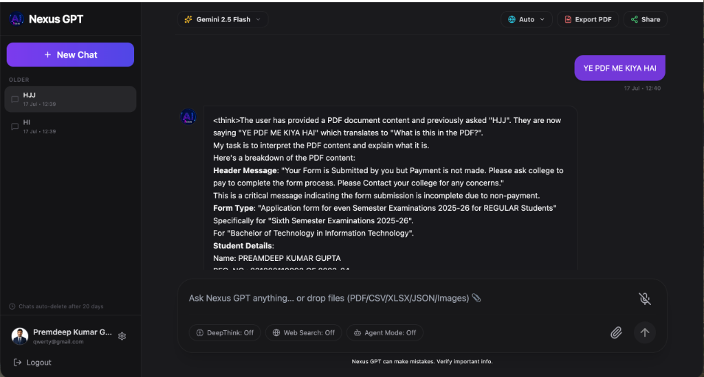
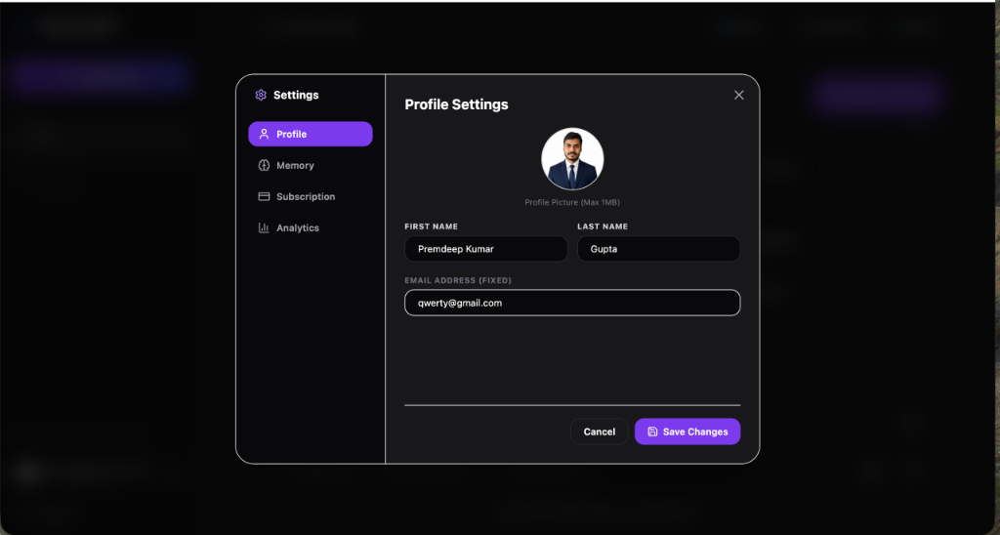
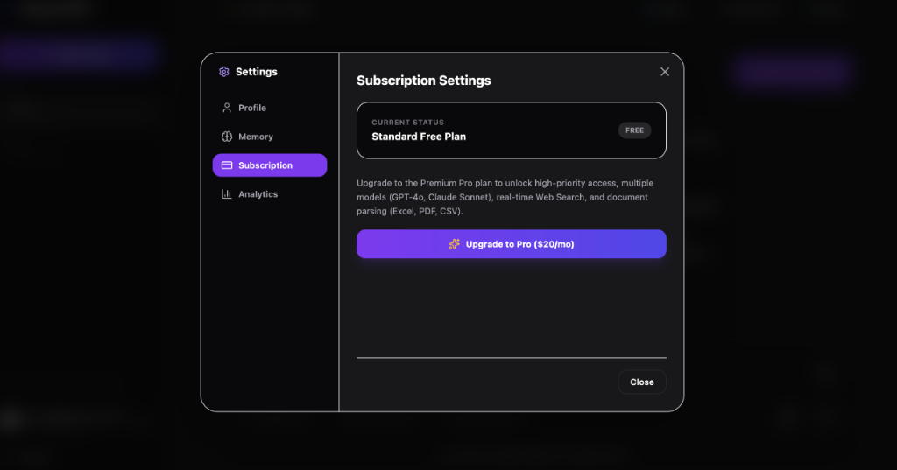
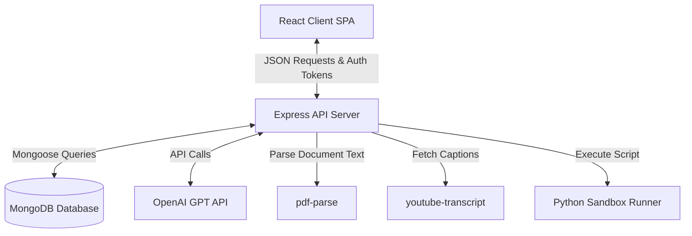

# 

<div align="center">

# 🌐 Nexus GPT
### *Empowering Your Intelligence — A Next-Generation Multimodal AI Assistant Platform*

[](https://react.dev/)
[](https://nodejs.org/)
[](https://expressjs.com/)
[](https://www.mongodb.com/)
[](https://openai.com/)
[](https://tailwindcss.com/)

</div>

---

## 🌟 Introduction

**Nexus GPT** is a premium, full-stack AI Assistant application that breaks down traditional barriers between conversations, document analysis, video transcripts, and code execution. Designed with a dark futuristic glassmorphic aesthetic, it allows developers, students, and professionals to work seamlessly with artificial intelligence in a unified interface.

---

## 📸 App Previews & Demos

### 💬 Chat Interface (Main Workspace)


### 📄 Multi-modal PDF & Document Analyzer


### ⚙️ Profile Settings Overlay


### 💳 Subscription & Pro Plan Tiers


> [!TIP]
> ### 🎥 Project Demo Video
> A step-by-step video tour of Nexus GPT is available! If you have recorded your local demonstration, place the video as `assets/demo.mp4` to automatically link it here.
> 
> [**Watch the Demo Video**](assets/demo.mp4)

---

## 🚀 Core Features

### 1. 🧠 Multimodal AI Chat & Prompting
* Input text queries or upload images directly to OpenAI's models for advanced reasoning.
* Support for uploading **PDFs, CSVs, JSON, and Excel (.xlsx, .xls)**.
* **Document Parsing**: Parses PDFs (via `pdf-parse`) and datasets dynamically, allowing you to ask questions, extract key details, or summarize raw data files immediately.

### 2. 🎬 YouTube Video Summarizer
* Paste any YouTube video link into the chat.
* Nexus GPT fetches the video's transcript automatically (via `youtube-transcript`) and parses it so you can get smart summaries or ask specific questions about the video content.

### 3. 🐍 Python Code Execution Sandbox
* Code directly in the interface and execute scripts.
* Nexus GPT includes an isolated **Python sandbox runner** that runs Python scripts server-side and displays real-time execution logs, outputs, and errors.

### 4. 🗄️ Session Persistence & Memory
* **Active Sessions**: Save, fetch, and delete individual chat sessions.
* **AI Memories**: Instruct the AI to remember custom credentials, preferences, or project contexts across chats.

### 5. 🔗 Secure Link Sharing
* Instantly generate public shareable links for your chat sessions.
* Allows guest users to view the entire chat hierarchy in a beautiful read-only preview screen.

---

## 🛠️ Tech Stack

| Tier | Technologies Used |
| :--- | :--- |
| **Frontend** | React (Vite SPA), Tailwind CSS, Context API, Axios, Lucide Icons |
| **Backend** | Node.js, Express, Multer (multipart storage), JWT (jsonwebtoken), bcryptjs |
| **AI & Parsing**| OpenAI API SDK, `pdf-parse` (PDF extraction), `youtube-transcript` |
| **Database** | MongoDB, Mongoose (Schemas for users, memories, sessions, & shared chats) |
| **Development**| Nodemon, ESLint, PostCSS |

---

## 📐 Architecture Diagram

Below is the design system flow showing how requests move from the single page application client down to external APIs and database endpoints:



---

## 📂 Folder Structure

```
Nexus GPT/
├── assets/                    # Project screenshots and banners
│   ├── banner.png
│   ├── chat_interface.png
│   ├── pdf_analyzer.png
│   ├── profile_settings.png
│   └── subscription_settings.png
├── backend/                   # Node.js + Express backend API
│   ├── controller/            # Authentication, session, and prompt controllers
│   ├── middleware/            # JWT authentication validation middleware
│   ├── model/                 # MongoDB Schemas (User, ChatSession, SharedChat)
│   ├── routes/                # Express API endpoints routing layer
│   ├── config.js              # Application global configuration
│   ├── index.js               # Backend entry point
│   ├── package.json           # Backend dependencies and nodemon scripts
│   └── .env                   # JWT secret, MongoDB URI, OpenAI API key
├── frontend/                  # React + Tailwind CSS client dashboard
│   ├── src/
│   │   ├── components/        # Sidebar, Promt/Chat, ShareView, Login, Signup
│   │   ├── context/           # React Context (Auth, Theme, Chat sessions)
│   │   ├── App.jsx            # Core layout routing
│   │   ├── main.jsx           # App bootstrapping
│   │   └── config.js          # API base URL configuration mapping
│   ├── tailwind.config.js     # Tailwind setup parameters
│   └── package.json           # Frontend dependency modules
└── README.md                  # Root documentation overview
```

---

## 🔌 API Reference

### 🔐 User & System APIs (`/api/v1/user`)
| Method | Endpoint | Description | Authentication |
| :--- | :--- | :--- | :--- |
| `POST` | `/signup` | Registers a new user account | Public |
| `POST` | `/login` | Authenticates user & issues cookies | Public |
| `GET` | `/logout` | Clears active cookie session | Public |
| `PUT` | `/update-profile` | Updates user details | JWT Cookie |
| `GET` | `/settings` | Retrieves AI settings and preferences | JWT Cookie |
| `POST` | `/memories` | Adds custom user-context memory items | JWT Cookie |
| `DELETE`| `/memories/:memoryId` | Deletes a customized memory card | JWT Cookie |
| `POST` | `/upgrade` | Upgrades user profile subscription | JWT Cookie |

### 🤖 Nexus GPT Prompt APIs (`/api/v1/nexusgpt`)
| Method | Endpoint | Description | Authentication |
| :--- | :--- | :--- | :--- |
| `POST` | `/promt` | Submits prompt (supports files, text, & videos) | JWT Cookie |
| `POST` | `/share` | Creates a public shared access ID for a chat | JWT Cookie |
| `GET` | `/share/:shareId` | Fetches a public read-only chat copy | Public |
| `POST` | `/run-python` | Executes Python code inside runner sandbox | JWT Cookie |
| `POST` | `/sessions/save` | Saves current chat history list | JWT Cookie |
| `GET` | `/sessions` | Lists all chat sessions for active user | JWT Cookie |
| `GET` | `/sessions/:sessionId` | Retrieves one specific chat history | JWT Cookie |
| `DELETE`| `/sessions/:sessionId` | Deletes a chat history session | JWT Cookie |

---

## ⚙️ Installation & Setup

### Prerequisites
* **Node.js** (v18 or higher recommended)
* **MongoDB** (Local instance or MongoDB Atlas cluster connection string)
* **OpenAI API Key**
* **Python** (installed on local system PATH to run script sandbox runner)

### Step 1: Clone and Configure Environment

1. Navigate to the backend directory and create a `.env` file:
   ```bash
   cd backend
   touch .env
   ```
2. Add your environment credentials inside `backend/.env`:
   ```env
   PORT=4001
   MONGO_URI=mongodb+srv://your-mongodb-url
   JWT_SECRET=your_jwt_signing_secret_key
   OPENAI_API_KEY=your_openai_api_key_here
   FRONTEND_URL=http://localhost:5173
   ```

### Step 2: Start the Backend Server
```bash
cd backend
npm install
npm run dev
```
The server will boot and listen on `http://localhost:4001`.

### Step 3: Start the Frontend App
1. Open a new terminal instance.
2. Install client dependencies and launch Vite dev server:
   ```bash
   cd frontend
   npm install
   npm run dev
   ```
The app will run locally on `http://localhost:5173`. Open this URL in your browser to experience **Nexus GPT**!

---

## 🤝 Contribution Guidelines
Contributions are welcome! Please feel free to open a Pull Request or report bugs via issues. For major changes, please open an issue first to discuss what you would like to modify.
